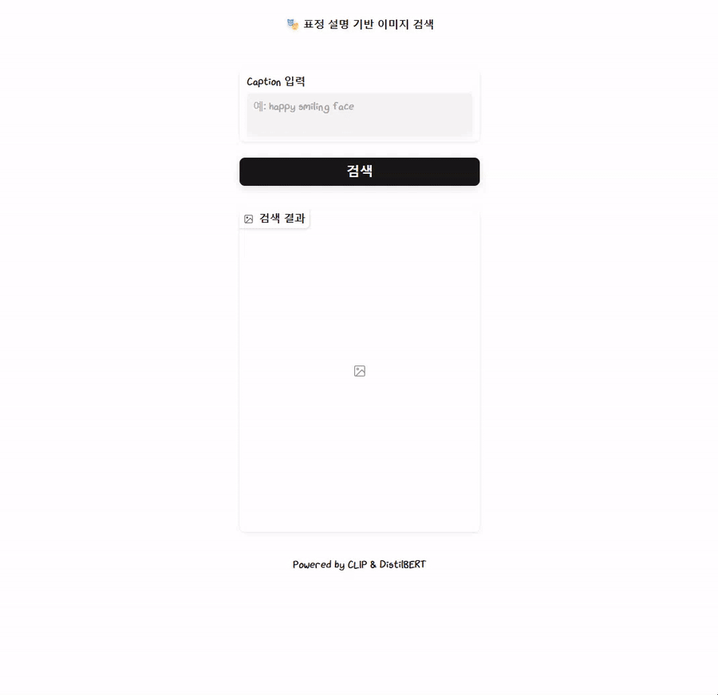
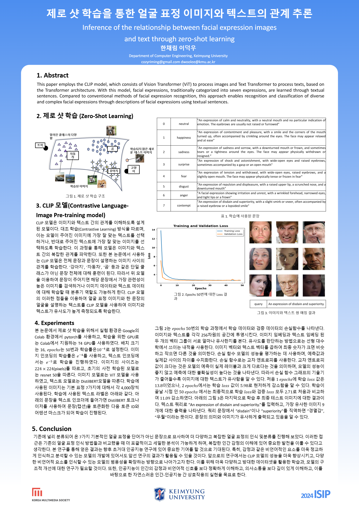

<h1 align="center">
  Facial Expression Text-Image Zero-Shot Retrieval
</h1>

  **제로샷 학습(Zero-Shot Learning)** 을 기반으로 한 **CLIP(Contrastive Language-Image Pre-training)** 모델을 활용하여 얼굴 표정 이미지 검색을 합니다.<br/>
  논문 연구을 GUI 형태로 구현하여 실제 텍스트 입력으로 이미지를 실시간 검색을 할 수 있습니다.

---

## 📸 GUI 시연 GIF

<p align="center">
  
</p>

---

## 📄 논문 개요

**제목**: 제로샷 학습을 통한 얼굴 표정 이미지와 텍스트의 관계 추론   
**저자**: Chaerim Han, Deokwoo Lee  
**소속**: 계명대학교 컴퓨터공학과  

본 연구는 CLIP 모델을 사용하여 기존의 단순한 7가지 표정(중립, 행복, 슬픔, 놀람, 두려움, 혐오, 분노, 경멸)을 넘어, 문장 형태의 묘사를 기반으로 더욱 다양하고 복잡한 표정을 인식하고 분류하는 제로샷 학습 방법을 제안합니다.<br/>
이미지-텍스트 간의 복잡한 관계를 학습하여 기존 방법 대비 폭넓고 세밀한 분석을 가능하게 합니다.

---

## 📚 주요 연구 내용

- 기존 7가지 기본 표정 분류를 넘어 텍스트 문장으로 얼굴 표정의 의미적 특성을 학습  
- CLIP 모델을 이용하여 이미지와 문장 간의 관계를 효과적으로 추론  
- 이미지와 텍스트 데이터를 각각 임베딩하여 유사도를 cosine similarity를 통해 측정  
- 제로샷 학습 기법으로 학습 데이터에 없는 새로운 표정 표현도 인식 가능

자세한 내용과 실험 결과는 첨부된 논문 PDF를 참고하세요.

📕 [논문 PDF 다운로드](assets/papers.pdf)


---


## 🚀 프로젝트 구조

```
.
├── demo.py             # GUI 앱 (Gradio 기반, 이미지-텍스트 검색 기능)
├── train.py            # CLIP 모델 학습 및 검증
├── dataset.py          # 데이터셋 처리 및 전처리 과정 정의
├── model.py            # 모델 정의 (CLIP 모델: ResNet50 + DistilBERT)
├── config.py           # 설정 (경로, 하이퍼파라미터, GPU 설정 등)
├── utils.py            # 유틸리티 함수 (모델 저장 및 로드 등)
├── images/             # 얼굴 표정 이미지 데이터셋
├── captions.csv        # 이미지 파일과 텍스트(캡션) 매핑 데이터
└── requirements.txt    # Python 의존성 패키지
```

---

## 🛠 설치 및 사용법

### 환경 설정

```bash
git clone https://github.com/your-username/facial-expression-retrieval.git
cd facial-expression-retrieval

python -m venv venv
# macOS/Linux
source venv/bin/activate
# Windows
venv\Scripts\activate

pip install --upgrade pip
pip install -r requirements.txt
```

### 데이터 준비

- 이미지 데이터를 `images/` 폴더에 배치합니다.
- `captions.csv` 파일을 이미지와 텍스트 묘사 형식으로 구성합니다.
- 사전 학습된 모델 `model_final.pth`를 프로젝트 루트 디렉토리에 위치시킵니다.

### GUI 실행

```bash
python demo.py
```

브라우저에서 `http://127.0.0.1:7860` 접속 후,  
텍스트로 얼굴 표정을 묘사하여 이미지 검색을 수행합니다.

예시:
> An expression of shock and astonishment.

---
## 🖼️ 학술대회 발표 포스터  
<p align="center">
  
</p>

---


## 📬 연락처

cozyriming@gmail.com   

